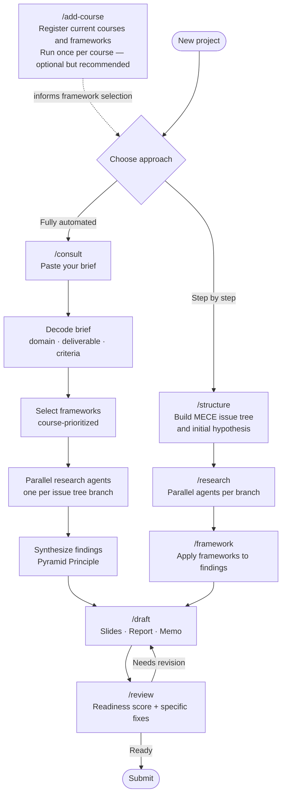

# Consultant AI

A Claude Code plugin that guides you through any business research project using top-tier consulting methodology — McKinsey, BCG, Deloitte quality, applied to class assignments, case studies, and real consulting work.

## What it does

- Decodes any business brief and identifies the domain, deliverable format, and marking criteria
- Structures problems as MECE issue trees with initial hypotheses (hypothesis-driven approach)
- Selects and applies the right frameworks for the domain — automatically or on demand
- Spawns parallel research agents to work multiple questions simultaneously
- Synthesizes findings using the Pyramid Principle (answer first, then support)
- Drafts consultant-quality output: slide decks, reports, or memos
- Reviews work against marking criteria or consulting quality standards

Supports any business domain: strategy, marketing, finance, supply chain, information systems, international business, operations, or multi-domain.

---

## Installation

Clone the repo and run the setup script to symlink the skills into Claude Code's global commands directory.

```bash
git clone https://github.com/cassieyue/consultant-ai.git ~/Documents/projects/consultant-ai
cd ~/Documents/projects/consultant-ai
chmod +x setup.sh
./setup.sh
```

Then restart Claude Code for the new skills to appear.

---

## Skills

### `/consult`
The main orchestrator. Start here for any new project.

Paste or upload your brief — the skill decodes the domain and mode, builds a MECE issue tree, selects frameworks, spawns parallel research agents, synthesizes findings, and drafts the deliverable.

```
/consult
```

---

### `/add-course [course name]`
Register a course so the plugin prioritizes the frameworks you're currently studying.

```
/add-course International Business and Global Responsibility
/add-course Supply Chain Management — covering SCOR, TCO, make-vs-buy
```

Once registered, `/consult` and `/framework` will surface your course frameworks first when they apply.

---

### `/structure [problem description]`
Build a MECE issue tree for any business problem before research begins.

```
/structure Should MG Motors enter the Mauritius market and if so, how?
/structure Why is our supply chain cost 30% above industry benchmark?
```

Returns: central question, hypothesis, 2–4 MECE branches, evidence needed per branch, framework mapping, and research priority order.

---

### `/framework [framework name]`
Apply a specific framework to your current project. Reads the application template, loads your course context, and works through each dimension with data and "so what" implications.

```
/framework pestel
/framework hofstede
/framework porter's five forces
/framework modes of entry
/framework bcg matrix
```

---

### `/research [topic or question]`
Structured research on a specific question. Breaks the question into sub-questions and spawns parallel agents to research each one simultaneously.

```
/research Mauritius economic and regulatory environment for automotive companies
/research consumer behavior trends in the UK plant-based food market
```

Returns findings organized by sub-question with sources cited by authority level.

---

### `/draft [section or "full"]`
Draft consultant-quality output in the required format (slides, report, or memo). Applies Pyramid Principle structure throughout — answer first, then support.

```
/draft executive summary
/draft market entry recommendation
/draft full
```

Slide headers are written as insights, not labels. Academic mode maps content to marking criteria.

---

### `/review`
Senior partner QA review. Checks structure (MECE, Pyramid Principle), content quality (specific claims, correct framework application, clear recommendation), source authority, academic compliance, and consulting writing standards. Returns a readiness score out of 10 with specific fixes.

```
/review
```

---

## Framework Library

15 application templates covering all major business domains. Each template specifies what data to collect, how to structure the analysis, and what the "so what" insight should look like.

| Domain | Frameworks |
|---|---|
| Strategy | Porter's Five Forces, VRIO, McKinsey 7S, Ansoff Matrix, BCG Matrix |
| Marketing | STP, Marketing Mix (4Ps/7Ps) |
| Finance | Financial Ratio Analysis |
| Supply Chain | SCOR Model |
| International Business | PESTEL, Hofstede's Cultural Dimensions, CAGE Distance, Modes of Entry |
| Consulting Method | MECE, Pyramid Principle |

---

## Modes

The plugin adapts its behavior based on the project context:

| Mode | When | Behavior |
|---|---|---|
| **Academic** | Class assignment with marking criteria | Applies course frameworks, cites sources per rubric, maps content to marking criteria |
| **Learning** | Studying a framework in class | Applies framework and explains the logic — teaches through doing |
| **Professional** | Real consulting or internship work | Full hypothesis-driven, MECE, Pyramid Principle, no hand-holding |

---

## Typical workflow



---

## Extending the plugin

**Add a framework**: Create a new `.md` file in `frameworks/` following the existing template structure (when to use, dimensions, data to collect, output format, common mistakes). Add an entry to `frameworks/index.md`.

**Modify a skill**: Edit the relevant file in `commands/`. Changes take effect immediately — no restart needed.

**Add a course**: Run `/add-course` — course context is stored in `~/.claude/memory/consultant-ai-courses.md`.

---

## Project structure

```
consultant-ai/
├── commands/          # Claude Code skills (symlinked to ~/.claude/commands/)
│   ├── consult.md
│   ├── add-course.md
│   ├── framework.md
│   ├── structure.md
│   ├── research.md
│   ├── draft.md
│   └── review.md
├── frameworks/        # Framework application templates (symlinked to ~/.claude/consultant-ai/frameworks/)
│   ├── index.md
│   ├── pestel.md
│   ├── hofstede.md
│   └── ...
├── examples/          # Example briefs and outputs — local only, not tracked
├── setup.sh           # Symlink installer
├── .gitignore
└── README.md
```
