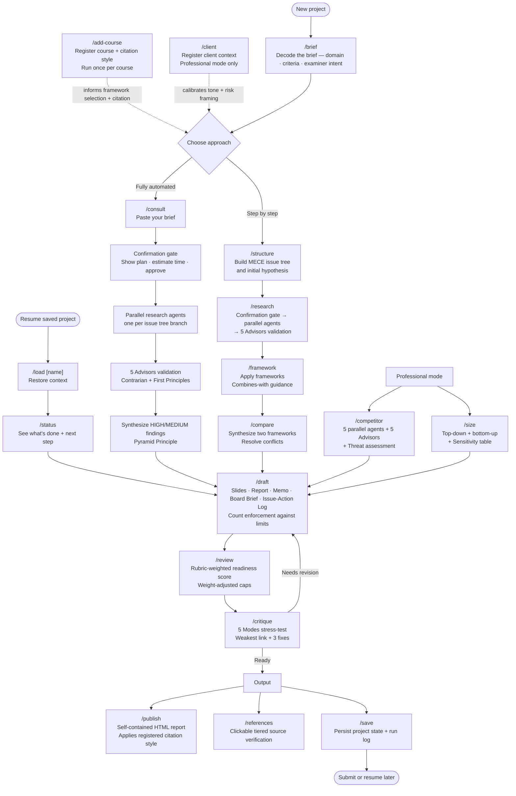

# Consultant AI

A Claude Code plugin that guides you through any business research project using top-tier consulting methodology — McKinsey, BCG, Deloitte quality, applied to class assignments, case studies, and real consulting work.

## What it does

- Decodes any assignment brief (PDF or text) — extracts domain, marking criteria, examiner intent, and recommended frameworks
- Structures problems as MECE issue trees with initial hypotheses before research begins
- Shows a research plan and waits for confirmation before spawning agents — no silent 5-minute runs
- Spawns parallel research agents, then validates key claims through a Contrarian + First Principles panel
- Synthesizes only HIGH and MEDIUM confidence findings; flags DISPUTED and UNVERIFIED claims separately
- Drafts consultant-quality output: slide decks, reports, memos, board briefs, or issue-action logs — applying Pyramid Principle throughout
- Enforces word and slide count against stated limits and flags specific cuts when over
- Applies your registered citation style (Harvard, APA 7th, Chicago, MLA 9th) consistently across research, draft, and published output
- Reviews work against marking criteria with a rubric-weighted readiness score (heavily-weighted criteria failing cap the total score)
- Stress-tests the recommendation using the 5 Modes framework (Devil's Advocate, Contrarian Investor, Founder Thinking, First Principles, Therapist CEO)
- Synthesizes two framework outputs into a combined implication with conflict resolution
- Saves and restores full project state across sessions — issue tree, research findings, framework outputs, draft status
- Builds competitor profiles using parallel research agents with a threat assessment verdict
- Sizes markets top-down and bottom-up with sourced assumptions and a sensitivity table
- Registers client context for professional engagements — calibrates tone and risk framing to the client's profile
- Publishes a self-contained HTML report and a clickable, tiered references page

Supports any business domain: strategy, marketing, finance, supply chain, information systems, international business, operations, or multi-domain.

---

## Installation

Clone the repo and run the setup script to symlink the skills into Claude Code's global commands directory.

```bash
git clone https://github.com/cassieyue/consultant-ai.git ~/Documents/projects/consultant-ai
cd ~/Documents/projects/consultant-ai
chmod +x setup.sh
./setup.sh
```

Then restart Claude Code for the new skills to appear.

---

## Skills

### Setup

#### `/add-course [course name]`
Register a course so the plugin prioritizes the frameworks you're currently studying. Prompts for domain, frameworks covered, citation style (Harvard / APA 7th / Chicago / MLA 9th), and any professor-specific notes.

```
/add-course International Business and Global Responsibility
/add-course Supply Chain Management — covering SCOR, TCO, make-vs-buy
```

Once registered, `/consult` and `/framework` surface your course frameworks first. Citation style is applied automatically in `/research`, `/draft`, and `/publish`.

---

#### `/client [client name or description]`
Register a professional client. Saves industry, risk tolerance (Conservative / Balanced / Aggressive), key stakeholders, constraints, and engagement history. `/consult` reads this in professional mode to calibrate tone, certainty level, and risk framing.

```
/client Acme Corp — automotive, conservative risk appetite
/client
```

---

### Decode

#### `/brief [file path or pasted text]`
Decode any assignment brief before starting analysis. Extracts domain, deliverable format, marking criteria with weights, constraints, and reads between the lines to tell you what the examiner actually wants. Also flags which frameworks from your registered courses apply.

```
/brief ~/Documents/assignments/AE1-brief.pdf
/brief
```

Run this first on any new project — it takes 10 seconds and prevents misreading the brief downstream.

---

### Orchestrate

#### `/consult`
The main orchestrator. Start here for any new project.

Checks for an active project and offers to continue it or start fresh. Scans the run log for prior work on the same company or market. In professional mode, reads your registered client context. Decodes the brief, builds a MECE issue tree, selects a framework sequence, spawns parallel research agents, validates findings, synthesizes, and drafts.

```
/consult
```

---

### Structure

#### `/structure [problem description]`
Build a MECE issue tree for any business problem before research begins.

```
/structure Should MG Motors enter the Mauritius market and if so, how?
/structure Why is our supply chain cost 30% above industry benchmark?
```

Returns: central question, hypothesis, 2–4 MECE branches, evidence needed per branch, framework mapping, and research priority order.

---

### Research

#### `/research [topic or question]`
Structured research on a specific question. Breaks the question into sub-questions and spawns parallel agents to research each one simultaneously. Validates key claims through the 5 Advisors (Contrarian + First Principles) and returns findings with HIGH / MEDIUM / FLAG / DISPUTED / UNVERIFIED confidence tiers.

```
/research Mauritius economic and regulatory environment for automotive companies
/research consumer behavior trends in the UK plant-based food market
```

---

#### `/framework [framework name]`
Apply a specific framework to your current project. Reads the application template, loads course context, and works through each dimension with data and "so what" implications. Recommends which frameworks to run next based on each template's "Combines with" guidance.

```
/framework pestel
/framework hofstede
/framework porter's five forces
/framework modes of entry
/framework bcg matrix
/framework swot
```

28 framework templates available — see Framework Library below.

---

#### `/compare [framework-a] [framework-b]`
Synthesize two framework outputs from the session. Finds points of agreement, surfaces and resolves conflicts (with a verdict on which finding to trust), and produces a single combined implication for the central question.

```
/compare pestel hofstede
/compare porter's cage
```

---

#### `/competitor [company name]`
Build a one-page competitor profile. Spawns 5 parallel agents covering financials, products/positioning, strategy and recent moves, leadership, and known weaknesses. Validates key claims through the 5 Advisors. Ends with a specific 2–3 sentence threat assessment — not a generic list.

```
/competitor BYD — in the context of Nigeria market entry
/competitor Tesla
```

---

#### `/size [market description]`
Build a market sizing model. Produces a top-down TAM/SAM/SOM sizing and a bottom-up cross-check. Every assumption is sourced or explicitly flagged. If top-down and bottom-up diverge by more than 2×, explains why. Ends with a sensitivity table (pessimistic / base / optimistic) and a specific revenue range.

```
/size electric vehicles in Nigeria
/size plant-based food market in the UK
```

---

### Draft

#### `/draft [section or "full"]`
Produce consultant-quality output in the required format. Applies Pyramid Principle throughout — answer first, then support.

**Formats**: slides · written report · memo · board brief · issue-action log

After generating output, reports word count or slide count against any stated limit and flags specific cuts if over.

```
/draft full
/draft executive summary
/draft board brief
/draft issue-action log
```

Slide headers are written as insights, not labels. Academic mode maps content to marking criteria and applies the registered citation style.

---

### Quality assurance

#### `/review`
Senior partner QA review. Checks structure (MECE, Pyramid Principle), content quality (specific claims, correct framework application, clear recommendation), source authority, academic compliance, and consulting writing standards.

In academic mode: reads marking criteria and weights. Applies a score cap — a criterion worth ≥40% of the mark that has a critical issue caps the total score at 5/10; ≥30% caps at 6/10; ≥20% caps at 7/10. Summary shows the weight-adjusted score and the binding constraint.

```
/review
```

---

#### `/critique`
Stress-test a recommendation or plan using the 5 Modes framework. Selects 2–3 lenses based on what is being evaluated and returns specific, named weaknesses — not generic pushback. Ends with a single "weakest link" and three prioritized fixes.

```
/critique
/critique [paste recommendation text]
```

Modes: Devil's Advocate · Contrarian Investor · Founder Thinking · First Principles · Therapist CEO

---

### Output

#### `/publish [output path]`
Compiles all analysis, research findings, and framework outputs from the session into a self-contained HTML report. All CSS is inline, no external dependencies — opens in any browser. Applies the registered citation style to the works cited section.

```
/publish
/publish ~/Documents/mauritius-market-entry.html
```

---

#### `/references [output path]`
Generate a standalone HTML page with every source from the session as a clickable link. Sources are grouped by authority tier (Academic → Institutional → Specialist press → General press), each card shows what the source was used to establish, and there's a live search filter.

```
/references
/references ~/Documents/byd-nigeria-references.html
```

---

### Project management

#### `/save [project-name]`
Save the current session to a named project file. Captures: central question, hypothesis, issue tree, research findings with confidence scores, framework outputs, draft sections, review score, and constraints. Appends a one-line entry to the run log.

```
/save byd-nigeria
/save
```

---

#### `/load [project-name]`
Load a saved project, restoring full context and showing where to resume. Sets the project as active so `/consult` picks it up on next invocation.

```
/load byd-nigeria
/load
```

---

#### `/status`
Show a completion checklist for the current project — issue tree branches, frameworks applied, draft sections, review and critique runs, outputs published. Each incomplete item shows the command to run next. Reports word/slide count against the stated limit.

```
/status
```

---

#### `/project [command]`
Manage saved projects: create, list, switch, or delete.

```
/project list
/project new mg-mauritius
/project switch supply-chain-analysis
/project delete old-project
```

---

### Reference

#### `/help`
Print a full skill reference, grouped by workflow stage, with syntax and example invocations for every command. Run this if you are not sure which skill to use next.

```
/help
```

---

## Framework Library

28 application templates covering all major business domains. Each template specifies what data to collect, how to structure the analysis, the expected output format (table-first), and which frameworks to combine with.

| Domain | Frameworks |
|---|---|
| Strategy | Porter's Five Forces, VRIO, McKinsey 7S, Ansoff Matrix, BCG Matrix, SWOT Analysis, Value Chain Analysis, Business Model Canvas, Blue Ocean Strategy |
| Marketing | STP, Marketing Mix (4Ps/7Ps) |
| Finance | Financial Ratio Analysis, DuPont Analysis, CVP/Break-even Analysis, DCF Valuation |
| Supply Chain | SCOR Model, Make-vs-Buy Analysis |
| International Business | PESTEL, Hofstede's Cultural Dimensions, CAGE Distance, Modes of Entry |
| Operations | DMAIC/Lean Six Sigma |
| Any domain | Stakeholder Analysis, Balanced Scorecard, Risk Matrix |
| Consulting Method | MECE, Pyramid Principle |

All framework templates include a "Combines with" section that states which frameworks to run next and what output to pass between them. `reference/frameworks/index.md` contains recommended framework sequences by brief type (market entry, competitive strategy, operational improvement, etc.).

---

## Modes

The plugin adapts its behavior based on the project context:

| Mode | When | Behavior |
|---|---|---|
| **Academic** | Class assignment with marking criteria | Applies course frameworks, cites sources in registered style, maps content to marking criteria, applies rubric-weighted review scoring |
| **Learning** | Studying a framework in class | Applies the framework and explains the logic — teaches through doing |
| **Professional** | Real consulting or internship work | Hypothesis-driven, MECE, Pyramid Principle; reads client context to calibrate tone, certainty, and risk framing |

---

## Typical workflow



---

## Extending the plugin

**Add a framework**: Create a new `.md` file in `reference/frameworks/` following the existing template structure (when to use, components, output format with table, common mistakes, combines with). Add an entry to `reference/frameworks/index.md`.

**Modify a skill**: Edit the relevant `skills/[name]/SKILL.md` file. Changes take effect immediately — no restart needed.

**Add a course**: Run `/add-course` — stored in `~/.claude/memory/consultant-ai-courses.md`.

**Add a client**: Run `/client` — stored in `~/.claude/memory/consultant-ai-clients.md`.

---

## Project structure

```
consultant-ai/
├── .claude-plugin/
│   └── plugin.json           # Plugin manifest
├── SKILL.md                  # Root orchestrator (/consult) — symlinked to ~/.claude/commands/consult.md
├── skills/                   # Individual skills — each symlinked to ~/.claude/commands/
│   ├── add-course/SKILL.md
│   ├── brief/SKILL.md
│   ├── client/SKILL.md
│   ├── compare/SKILL.md
│   ├── competitor/SKILL.md
│   ├── critique/SKILL.md
│   ├── draft/SKILL.md
│   ├── framework/SKILL.md
│   ├── help/SKILL.md
│   ├── load/SKILL.md
│   ├── project/SKILL.md
│   ├── publish/SKILL.md
│   ├── references/SKILL.md
│   ├── research/SKILL.md
│   ├── review/SKILL.md
│   ├── save/SKILL.md
│   ├── size/SKILL.md
│   ├── status/SKILL.md
│   └── structure/SKILL.md
├── agents/
│   └── shared-rules.md       # Cross-cutting consultant standards for spawned agents
├── reference/
│   └── frameworks/           # 28 framework application templates (symlinked to ~/.claude/consultant-ai/frameworks/)
│       ├── index.md
│       ├── ansoff.md
│       ├── balanced-scorecard.md
│       ├── bcg.md
│       ├── blue-ocean.md
│       ├── business-model-canvas.md
│       ├── cage.md
│       ├── cvp-breakeven.md
│       ├── dcf.md
│       ├── dmaic.md
│       ├── dupont.md
│       ├── hofstede.md
│       ├── make-vs-buy.md
│       ├── marketing-mix.md
│       ├── mckinsey-7s.md
│       ├── mece.md
│       ├── modes-of-entry.md
│       ├── pestel.md
│       ├── porters-five-forces.md
│       ├── pyramid-principle.md
│       ├── ratio-analysis.md
│       ├── risk-matrix.md
│       ├── scor.md
│       ├── stakeholder-analysis.md
│       ├── stp.md
│       ├── swot.md
│       ├── value-chain.md
│       └── vrio.md
├── templates/                # Output format templates
│   ├── board-brief.md
│   ├── issue-action-log.md
│   ├── memo.md
│   ├── report.md
│   └── slides.md
├── docs/
│   └── PRD.md
├── examples/                 # Example briefs and outputs — local only, not tracked
├── setup.sh                  # Symlink installer
├── .gitignore
└── README.md
```
